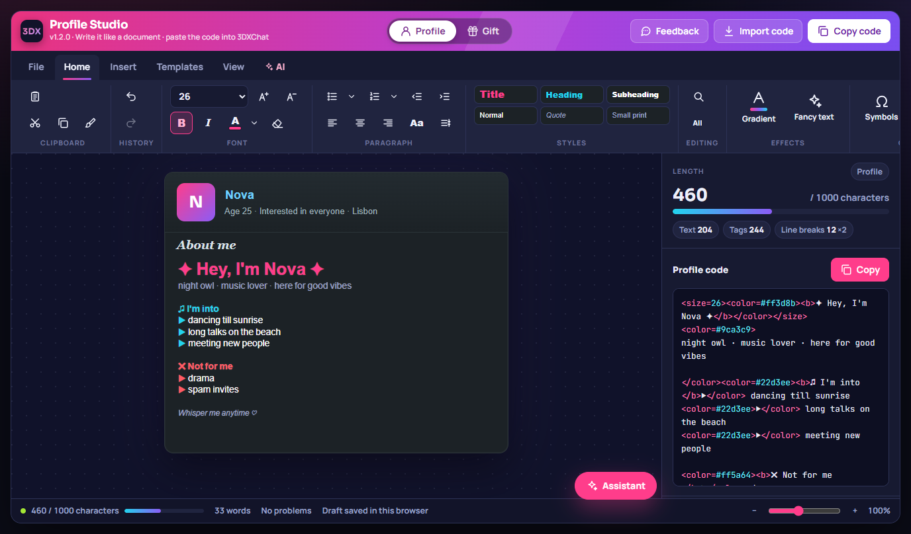
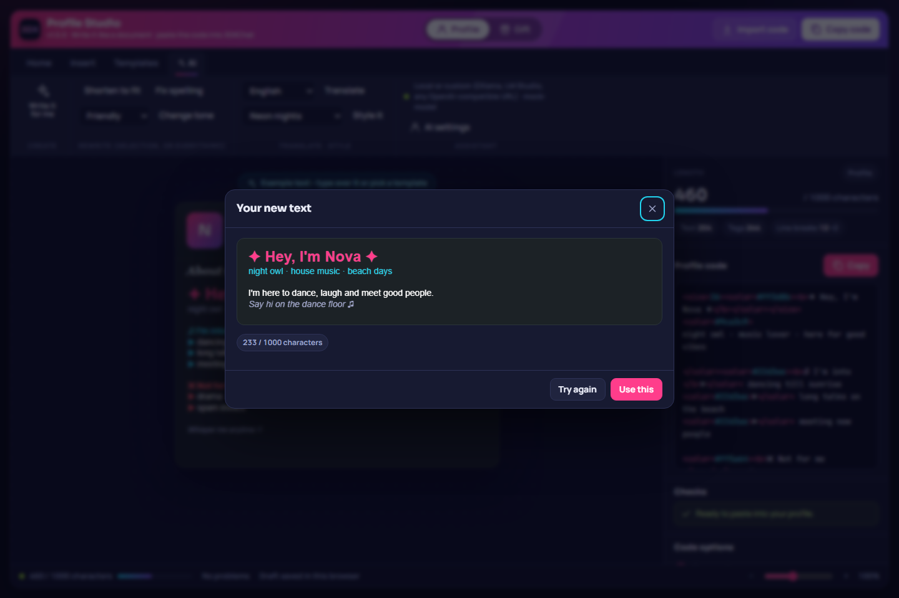

<h1 align="center">3DX Profile Studio</h1>

<p align="center">
  <b>Write your 3DXChat profile like a document.</b><br>
  Bold, colours, sizes, gradients, symbols and flags, with an AI writer that works with any AI provider.<br>
  Copy the code and paste it into the game.
</p>

<p align="center">
  <a href="https://deaeath.github.io/3dx-profile-studio/"></a>
  <a href="https://github.com/Deaeath/3dx-profile-studio/releases/latest"></a>
  <a href="LICENSE"></a>
</p>

<p align="center"></p>

---

## Use it

| | |
|---|---|
| 🌐 **Online** | Open **[deaeath.github.io/3dx-profile-studio](https://deaeath.github.io/3dx-profile-studio/)**. Nothing to install. |
| 💾 **Offline** | Download `3DX-Profile-Studio-x.y.z.html` from the **[latest release](https://github.com/Deaeath/3dx-profile-studio/releases/latest)** and double-click it. |
| 🧩 **From 3DXModKit** | The [3DXModKit](https://github.com/Deaeath/3DXModKit) control panel has an **Open Profile Studio** button on its Mods tab. It installs the latest release for you, checked against its checksum. |

Your drafts stay in your browser. Nothing is uploaded anywhere unless you use the AI features.

## What it does

- **Type on the card, not in code.** The page looks like your profile in the game: white Arial text on the dark panel, about 480 pixels wide. Select text and press **B**, **I**, a colour or a size, like in Word.
- **Gradients** per letter or per word, with a live count of what they cost. Colours blend in OKLab, so the middle doesn't go muddy.
- **Symbols** (about 790, sorted into categories), **flags** made of coloured blocks, **dividers** and **fancy letters** (circled, small caps, superscript, upside down and more).
- **Profile and Gift modes**, each with its own draft and templates. Gifts get `%username%` and a **Mass gift** maker that writes one copy per name and checks each one.
- **The shortest code it can find.** Tags are nested so the longest-lasting style sits outermost, red/white/blue/yellow/black are written as names, and spaces join the colour next to them. The 1000-character limit goes further.
- **Counts like the game does.** Profiles allow 1000 characters, gifts 240 characters and 255 bytes, and every line break counts twice. Symbols that don't show inside gifts are flagged.
- **Import** your current profile code and keep editing it. Pasting code into the card turns it into formatting.

### Word-style editing

- **Styles**: Title, Heading, Subheading, Normal, Quote and Small print for whole lines. After a heading, Enter goes back to Normal.
- **Lists**: bullets (•, ▶, ♥, ★, ✿, ♫ and more) and numbering (1., ①, ❶, Ⅰ., a)). Enter starts the next item, and Enter on an empty item ends the list.
- **Indent** with Tab and Shift+Tab. **Center** or **right-align** lines: the game has no alignment, so the Studio measures the line in the game font and pads it with spaces, which gets it close.
- **Change case** (UPPERCASE, lowercase, Title Case, Sentence case) without losing formatting, and a **format painter** to copy a look onto other text.
- **Find and replace** (Ctrl+F, Ctrl+H), **line tools** (Alt+↑/↓ to move, Ctrl+Shift+D to duplicate, Ctrl+Shift+K to delete), and a **word count**.
- **Cut, copy and paste** keep formatting inside the Studio. Ctrl+Shift+V pastes plain text. Right-click for the same tools plus AI actions; Shift+right-click gives the browser's menu with spelling suggestions.
- **File** tab: keep several **named documents** (New, Open, Save, Save as, Rename, Delete), **download** your code as a `.txt` file or **open** one. Everything stays in your browser.
- **View** tab: hide the code panel, zoom presets, and a list of **keyboard shortcuts**.

### Templates

**316 templates** in 28 categories: party, chill, romance, gamer, gothic, pastel, fantasy, hosts and DJs,
seasons and more for profiles; birthday, love, thank you, holidays and more for gifts. Search them, save
your own as templates, or **make one with AI** from a description such as "cozy witchy cottage". Every
template is checked to fit the game's limits, and gift templates only use symbols that show in gifts.

## AI writer

<p align="center"></p>

On the **AI** tab:

- **Write it for me.** Describe yourself in a few words, pick a tone and a look, and get a finished, formatted text.
- **Shorten to fit**, **Fix spelling**, **Change tone** and **Translate** the selection, or everything.
- **Style it.** Adds colours, sizes and symbols in a theme without changing your words.

Every result appears in a preview with its character count first. **Use this** puts it in, and **Ctrl+Z** takes it back.

- **Assistant** (Ctrl+K or the button on the page): just say what you want, such as "make my name a pink
  gradient" or "add a section about my hobbies", and it edits the card. Ctrl+Z undoes it.
- **Right-click** any text for AI actions: friendlier, funnier, flirtier, classier, add symbols, recolour,
  shorten, fix spelling or translate, for the selection or everything.
- **Smart checks**: one click to fit an over-long text, swap symbols that don't show in gifts, brighten text
  that's too dark to read, or proofread.

**It works right away, with no key or account.** The built-in **Free AI** runs on Claude and is
provided by 3DX Profile Studio. Your text goes through the Studio's small AI server to Anthropic and
nothing is stored. There's a fair-use limit (10 requests a minute per person).

Prefer another AI, or using it a lot? Bring a key from any of these providers instead. Open
**AI settings**, pick the provider, paste the key and press **Load models**:

| Provider | Notes |
|---|---|
| Anthropic (Claude) | Default model Claude Opus 5.5 |
| OpenAI (ChatGPT) | |
| Google (Gemini) | |
| OpenRouter | One key for hundreds of models from many vendors |
| Mistral · DeepSeek · xAI (Grok) · Together AI · Perplexity · Cohere | |
| Local or custom | Ollama, LM Studio or any OpenAI-compatible server. Ollama needs `OLLAMA_ORIGINS=*` |

With your own key, your key and text go **straight from the page to the provider you picked**, with no server in between. The key is kept in your browser only if you tick *Remember my key*. Usage is billed by that provider. Groq blocks requests from web pages, so use its models through OpenRouter.

## Building

The page is one HTML file built from `src/`:

```
python build.py              # dist/3DX-Profile-Studio.html and docs/index.html (GitHub Pages)
python build.py --release    # also dist/3DX-Profile-Studio-<version>.html, the .zip and SHA256SUMS.txt
node tests/test.js           # tests for the code generator, parser, gradients and AI helpers
```

`VERSION` holds the version number. `src/symbols.json` lists the symbols and which ones only work in profiles.

### Free AI server (`worker/`)

The Free AI is a Cloudflare Worker that keeps the Anthropic key as an encrypted secret, so the key is
never in this repository or in the page. It only answers requests from the published page and the
downloaded file, limits each visitor to 10 requests a minute (exact counting with a Durable Object),
can cap requests per day (`DAILY_LIMIT`), and streams Claude's answer back.

```
cd worker
npm install
npx wrangler login
npx wrangler secret put ANTHROPIC_API_KEY      # name is ANTHROPIC_API_KEY; paste the key as the value
npx wrangler deploy
```

`AI_PROXY_URL` holds the Worker's address; `build.py` puts it into the release page. Delete that file
to build a page without the Free AI. Model, effort and limits are set in `worker/wrangler.toml`.
Set a monthly spend limit for the key's workspace in the Anthropic Console as a backstop.

## Legal

3DX Profile Studio is a fan-made tool and isn't affiliated with or endorsed by the makers of 3DXChat. MIT License.
